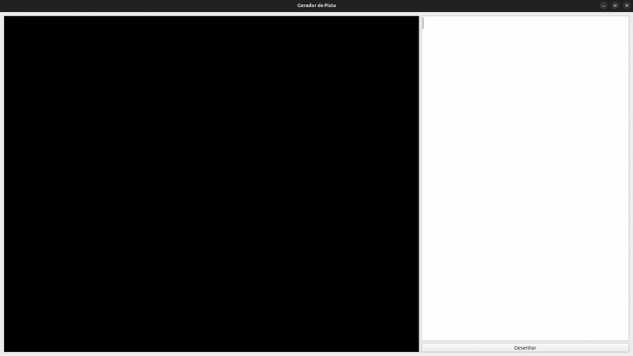

# FollowerTrackCreator

**FollowerTrackCreator** é uma ferramenta simples para auxiliar no **desenho de pistas** usadas em competições de seguidores de linha, seguindo o formato da categoria **Robotrace** do *All Japan Micromouse Contest*.  

A ideia é descrever a pista como uma **lista de segmentos** (retas e arcos) em um painel de texto, e visualizar automaticamente o traçado no painel gráfico.

---

## ✨ Funcionalidades
- Editor de texto integrado para descrição da pista.  
- Suporte a comandos básicos como retas e arcos (`reta`, `arco l`, `arco r`).  
- Atualização automática do desenho ao pressionar **Enter** ou **Shift+Enter**.  
- Ajuste automático da cena para visualizar toda a pista.    

---

## 🖼️ Demonstração



## ⚙️ Instalação

Clone o repositório:

```bash
git clone https://github.com/seu-usuario/FollowerTrackCreator.git
cd FollowerTrackCreator
```

Crie um ambiente virtual (opcional, mas recomendado):

```bash
python3 -m venv venv
source venv/bin/activate   # Linux/macOS
venv\Scripts\activate      # Windows
```

Instale as dependências:

```bash
pip install -r requirements.txt
```

### Dependências principais
- [PyQt5](https://pypi.org/project/PyQt5/) — interface gráfica.  
- Python ≥ 3.8  

O arquivo `requirements.txt` pode conter algo simples como:
```
PyQt5>=5.15
```

---

## ▶️ Utilização

Execute a aplicação com:

```bash
python main.py
```

A janela se abrirá com duas áreas:
- **Painel lateral (texto):** onde você digita a sequência de comandos da pista.  
- **Área gráfica:** mostra a pista correspondente.  

### Comandos disponíveis
- `inicio x y angulo` → Define ponto inicial `(x, y)` e direção em graus.  
- `reta d` → Desenha uma reta de comprimento `d`.  
- `arco l r θ` → Desenha um arco à esquerda de raio `r` e ângulo `θ`.  
- `arco r r θ` → Desenha um arco à direita de raio `r` e ângulo `θ`.  

### Exemplo de pista

```txt
inicio 250 100 0
tamanho 600 400
reta 100
reta 100
arco r 100 180
reta 300
arco r 100 180
reta 100
```

---


